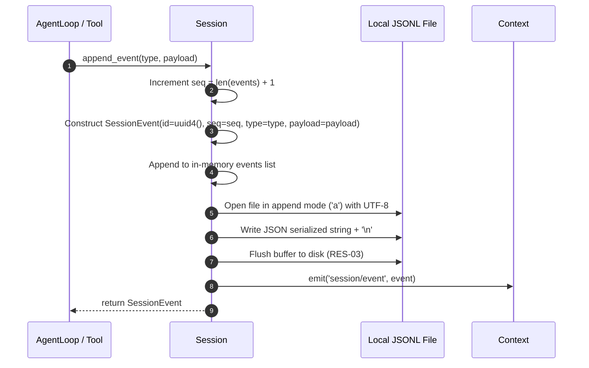

# Unit 1 Business Logic Model: Core Kernel & Event Sourcing Store

This document describes the event execution lifecycle, waterfall pipeline mechanics, and session persistence algorithms for Unit 1.

---

## 1. Event Pipeline Execution Model

```mermaid
flowchart TD
    subgraph BroadcastEvent["Broadcast Event Pipeline (ctx.emit)"]
        EmitCall["ctx.emit('session/event', event)"]
        FetchListeners["Fetch registered listeners for event"]
        SequentialExec["Iterate listeners sequentially with await"]
        DoneBroadcast["Broadcast Complete"]
        EmitCall --> FetchListeners --> SequentialExec --> DoneBroadcast
    end

    subgraph WaterfallPipeline["Waterfall Interceptor Pipeline (ctx.pipe)"]
        PipeCall["ctx.pipe('agent/pre-step', context_data)"]
        ChainIndex["Wrap handlers into recursive next() chain"]
        H1["Handler 1: Inspect/Mutate -> await next()"]
        H2["Handler 2: Inspect/Mutate -> await next()"]
        HDefault["Base/Final Resolver"]
        PipeDone["Return Final Transformed Value"]

        PipeCall --> ChainIndex --> H1 --> H2 --> HDefault --> PipeDone
    end
```

### 1.1 Waterfall Middleware Algorithm
1. Collect all registered handlers for `event` in registration order: $[h_1, h_2, \dots, h_n]$.
2. Define dispatch function `dispatch(i, current_value)`:
   - If $i == n$, return `current_value`.
   - Else, invoke $h_{i+1}(\text{current\_value}, \text{async def next(): return await dispatch}(i+1, \text{modified\_value}))$.
3. Any handler can rewrite values, pass them downstream, or return early without invoking `next()`.

---

## 2. Session Event Append & Atomic Persistence Algorithm

### 2.1 Session Recovery Algorithm
1. Open session `.jsonl` file at `~/.dsh/sessions/{session_id}.jsonl`.
2. Read line-by-line, parsing each line via `SessionEvent.model_validate_json(line)`.
3. Validate monotonic `seq` continuity ($seq_k = k$).
4. Reconstruct in-memory `Session` object with full historical events loaded.
