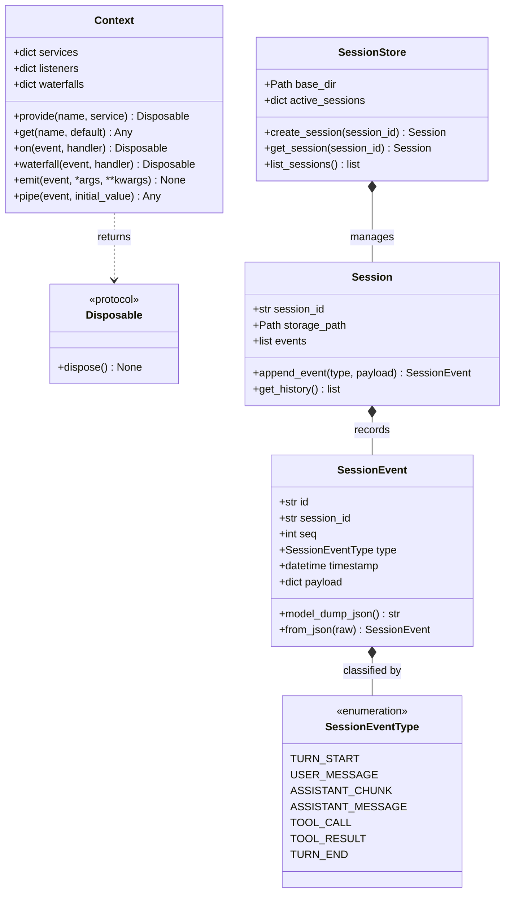

# Unit 1 Domain Entities: Core Kernel & Event Sourcing Store

This document defines the core domain entities, data models, enumerations, and type contracts for Unit 1.

---

## 1. Domain Entity Class Diagram

---

## 2. Entity Specifications

### 2.1 `SessionEvent`
- **Fields**:
  - `id`: `str` — Unique event identifier (UUIDv4).
  - `session_id`: `str` — Identifier of the session to which this event belongs.
  - `seq`: `int` — Monotonically increasing sequence number starting at `1`.
  - `type`: `SessionEventType` — Classification enum.
  - `timestamp`: `datetime` — UTC timestamp of event creation.
  - `payload`: `dict[str, Any]` — Event-specific data dictionary.
- **Invariants**:
  - `seq` must be strictly positive and greater than the preceding event's `seq`.
  - `payload` must be JSON-serializable.

### 2.2 `Session`
- **Fields**:
  - `session_id`: `str` — Unique session identifier.
  - `events`: `list[SessionEvent]` — In-memory ordered event stream.
  - `storage_path`: `Path` — File path to the append-only `.jsonl` file.
- **Behavior**:
  - `append_event(type, payload)`: Generates next `SessionEvent`, appends to in-memory list, writes and flushes JSON string line to disk, and triggers `ctx.emit("session/event", event)`.

### 2.3 `Context` & `Disposable`
- **Fields**:
  - `_services`: `dict[str, Any]` — Map of registered service names to instances.
  - `_listeners`: `dict[str, list[Callable]]` — Map of event names to async listener functions.
  - `_waterfalls`: `dict[str, list[Callable]]` — Map of waterfall event names to interceptors.
- **Disposable**:
  - Encapsulates unbind callbacks. Calling `dispose()` removes the specific service or listener from the `Context`.
