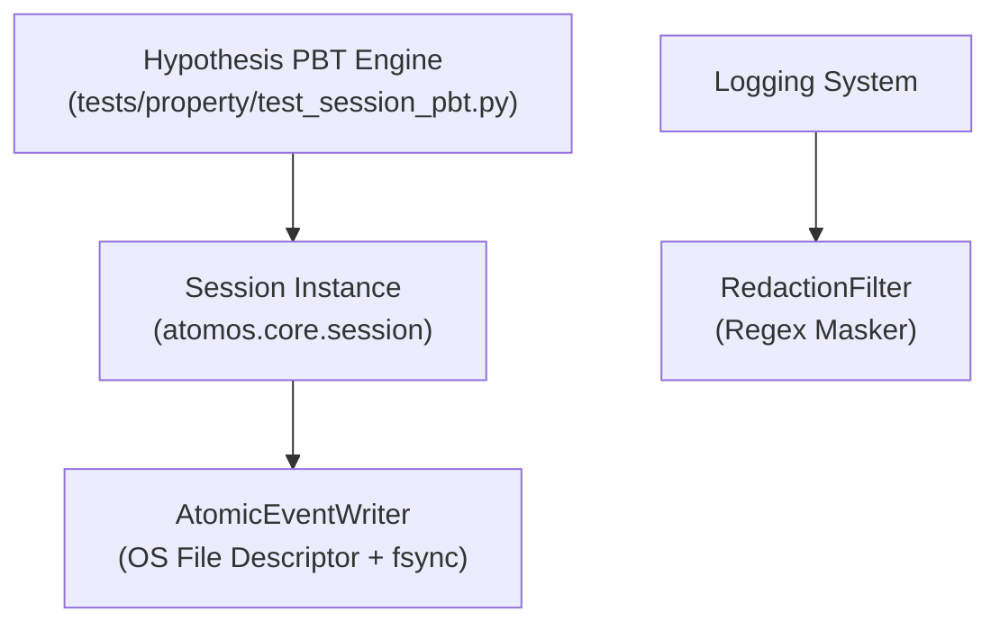

# Unit 1 Logical Components: Core Kernel & Event Sourcing Store

This document specifies the internal logical components implementing non-functional capabilities for Unit 1.

---

## 1. Logical Component Architecture

---

## 2. Logical Components Breakdown

### 2.1 `AtomicEventWriter` (`atomos.core.session`)
- **Type**: Persistence / Resiliency Component
- **Purpose**: Wraps line-buffered append operations with `0o600` file permissions and `os.fsync()` for physical durability.
- **Responsibilities**:
  - Initializes `~/.atomos/sessions/` with `0o700` user permissions.
  - Appends serialized JSON lines to `.jsonl` files without locking delays.
  - Flushes buffer to guarantee zero data loss on unexpected termination.

### 2.2 `RedactionFilter` (`atomos.core.logging`)
- **Type**: Security Component
- **Purpose**: Intercepts standard log records across the application.
- **Responsibilities**:
  - Scans log messages for API key tokens, secret parameters, and bearer strings.
  - Masks detected patterns before output reaches stdout or log files (`SECURITY-03`).

### 2.3 `HypothesisEventStrategy` (`tests/property/`)
- **Type**: Testing / Quality Assurance Component
- **Purpose**: Generates arbitrary valid and edge-case `SessionEvent` structures.
- **Responsibilities**:
  - Exercises `SessionEvent` serialization and deserialization across varied Unicode, nested dictionaries, and boundary integers.
  - Verifies sequence monotonicity and round-trip identity (`PBT-01`, `PBT-02`).
