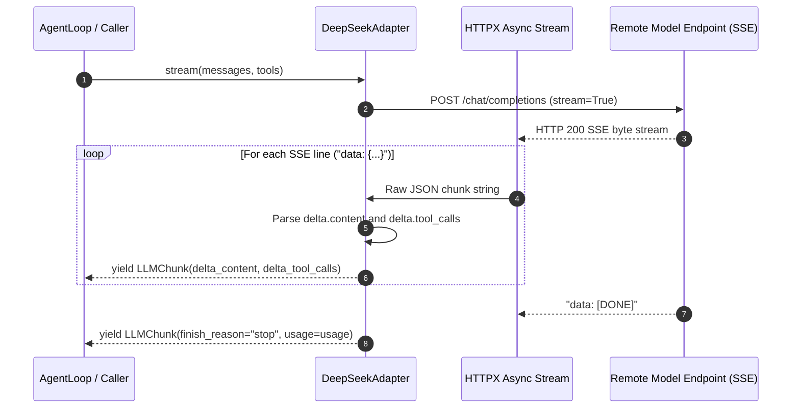

# Unit 2 Business Logic Model: LLM Adapter & Streaming Engine

This document details the SSE chunk stream parser, tool call accumulator, and adapter lifecycle for Unit 2.

---

## 1. Streaming Protocol & SSE Parsing Sequence

---

## 2. Incremental Tool Call Accumulator Algorithm

When a model invokes one or more tools simultaneously, the API streams arguments incrementally across multiple chunks.

### Tool Call Accumulator Workflow
1. Initialize an empty dictionary `tool_call_map: dict[int, dict[str, Any]] = {}`.
2. For each incoming `ToolCallFragment` with array `index`:
   - If `index` is not in `tool_call_map`, initialize entry: `{"id": fragment.id or "", "name": fragment.name or "", "arguments": ""}`.
   - If `fragment.id` is present, append or set `id`.
   - If `fragment.name` is present, append or set `name`.
   - If `fragment.arguments` is present, append to `arguments` string.
3. When the stream concludes (`finish_reason == "tool_calls"`):
   - Sort `tool_call_map` by `index`.
   - Return list of fully assembled tool calls: `[{"id": v["id"], "type": "function", "function": {"name": v["name"], "arguments": v["arguments"]}}]`.
