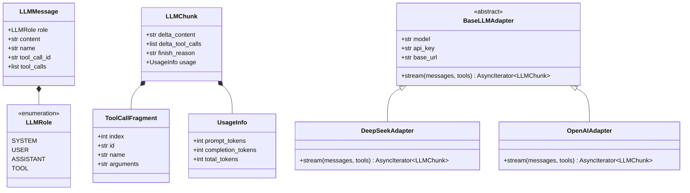

# Unit 2 Domain Entities: LLM Adapter & Streaming Engine

This document defines the domain models, streaming chunk entities, token usage records, and adapter interfaces for Unit 2 in `atomos`.

---

## 1. Domain Entity Class Diagram

---

## 2. Entity Specifications

### 2.1 `LLMMessage`
- **Fields**:
  - `role`: `LLMRole` (`system`, `user`, `assistant`, `tool`).
  - `content`: `str` — Text content of the prompt, response, or tool return value.
  - `name`: `str | None` — Optional function/tool identifier.
  - `tool_call_id`: `str | None` — Reference ID when `role == "tool"`.
  - `tool_calls`: `list[dict[str, Any]] | None` — List of tool requests generated by the model.

### 2.2 `ToolCallFragment`
- **Fields**:
  - `index`: `int` — Array position of the tool call in a multi-call turn.
  - `id`: `str | None` — Tool call ID fragment.
  - `name`: `str | None` — Function name fragment.
  - `arguments`: `str` — Incremental JSON argument string fragment (e.g. `{"pat`).

### 2.3 `LLMChunk`
- **Fields**:
  - `delta_content`: `str` — Incremental text token delta generated by the model.
  - `delta_tool_calls`: `list[ToolCallFragment]` — Incremental tool call fragments.
  - `finish_reason`: `str | None` — e.g. `"stop"`, `"tool_calls"`, `"length"`.
  - `usage`: `UsageInfo | None` — Final token accounting.

### 2.4 `BaseLLMAdapter` Protocol / Abstract Base
- **Methods**:
  - `async def stream(messages: list[LLMMessage], tools: list[dict[str, Any]] | None = None) -> AsyncIterator[LLMChunk]`: Asynchronously yield tokens and tool call fragments.
