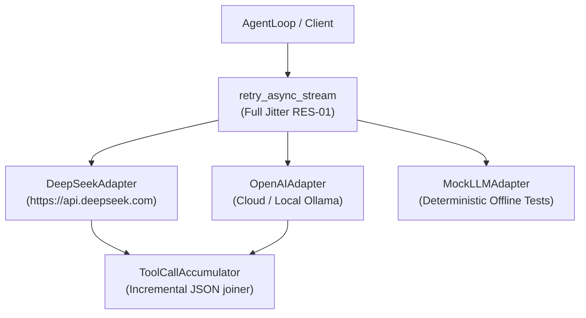

# Unit 2 Logical Components: LLM Adapter & Streaming Engine

This document specifies the internal logical components implementing streaming, retry, and local LLM execution for Unit 2.

---

## 1. Logical Component Architecture

---

## 2. Logical Components Breakdown

### 2.1 `BaseLLMAdapter` (`atomos.llm.base`)
- **Type**: Interface / Abstract Base
- **Responsibilities**:
  - Defines the core async streaming signature: `stream(messages, tools) -> AsyncIterator[LLMChunk]`.
  - Common validation for model parameters and message structures.

### 2.2 `DeepSeekAdapter` (`atomos.llm.providers.deepseek`)
- **Type**: Cloud Provider Client
- **Responsibilities**:
  - Formats OpenAI-compatible chat completion payload with DeepSeek model defaults (`deepseek-chat`, `deepseek-reasoner`).
  - Streams SSE lines using `httpx.AsyncClient`.

### 2.3 `OpenAIAdapter` (`atomos.llm.providers.openai`)
- **Type**: Dual Cloud & Local Provider Client
- **Responsibilities**:
  - Handles OpenAI cloud models (`gpt-4o`, `o1`, etc.).
  - Handles local models running on Ollama, LMStudio, vLLM, or llama.cpp (`http://localhost:11434/v1` or custom `base_url`).

### 2.4 `ToolCallAccumulator` (`atomos.llm.base`)
- **Type**: Data Accumulation Component
- **Responsibilities**:
  - Reconstructs split JSON string arguments and function names across fragmented streaming chunks into validated Python dictionaries.

### 2.5 `MockLLMAdapter` (`atomos.llm.mock`)
- **Type**: Test / Mock Component
- **Responsibilities**:
  - Provides deterministic, pre-canned text token streams and tool call simulations for fast, 100% offline test execution.
