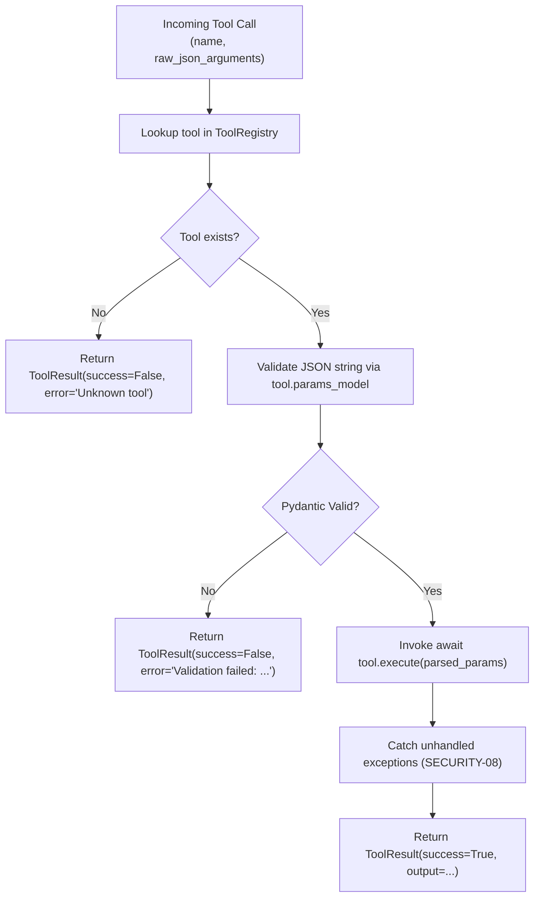

# Unit 3 Business Logic Model: Scoped Tool Registry & Built-ins

This document describes the tool execution pipeline, parameter validation flow, workspace path resolution, and subprocess execution lifecycle.

---

## 1. Tool Execution Pipeline

---

## 2. Built-in Tools Logic

### 2.1 `ViewFileTool` (`view_file`)
1. Resolve `file_path` relative to `workspace_root`.
2. Check that resolved canonical path resides inside `workspace_root` (`SECURITY-05`).
3. Read file with line numbering, offset, and limit slicing.
4. Format output with header `File: {file_path} (Lines {start}-{end})`.

### 2.2 `WriteFileTool` (`write_to_file`)
1. Resolve `file_path` inside `workspace_root`.
2. If file exists and `overwrite=False`, return error `"File already exists. Set overwrite=True to replace."`.
3. Create parent directories if missing.
4. Write content with UTF-8 encoding.

### 2.3 `ReplaceFileTool` (`replace_file_content`)
1. Resolve `file_path` and assert file exists.
2. Read file content. Verify `old_string` exists in file.
3. If `replace_all=False` and multiple occurrences found, return descriptive error indicating ambiguity.
4. Perform string replacement and write back atomically.

### 2.4 `RunCommandTool` (`run_command`)
1. Resolve execution `cwd` inside `workspace_root`.
2. Spawn subprocess with process group isolation (`preexec_fn=os.setsid`).
3. Enforce timeout (default 60s); on timeout, kill entire process group (`os.killpg`) to eliminate zombie processes (`RES-02`).
4. Capture combined stdout and stderr.
