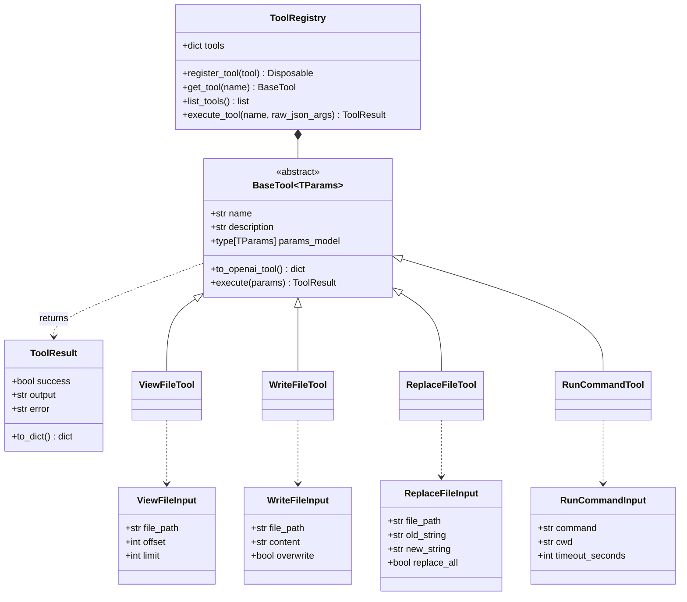

# Unit 3 Domain Entities: Scoped Tool Registry & Built-ins

This document defines the domain models, parameter schema structures, tool interfaces, and built-in filesystem and shell tool models for Unit 3 in `atomos`.

---

## 1. Domain Entity Class Diagram

---

## 2. Entity Specifications

### 2.1 `BaseTool[TParams]`
- **Fields**:
  - `name`: `str` — Unique tool identifier matching model invocation strings (e.g. `view_file`).
  - `description`: `str` — Detailed explanation of purpose and usage for prompt injection.
  - `params_model`: `type[TParams]` — Pydantic `BaseModel` defining schema and field constraints.
- **Methods**:
  - `to_openai_tool()`: Auto-generates OpenAI function schema (`{"type": "function", "function": {"name": ..., "description": ..., "parameters": ...}}`).
  - `async def execute(params: TParams) -> ToolResult`: Strongly-typed execution handler.

### 2.2 `ToolResult`
- **Fields**:
  - `success`: `bool` — Indicates if tool execution completed without internal or permission errors.
  - `output`: `str` — String output formatted for LLM context injection.
  - `error`: `str | None` — Sanitized error message (`SECURITY-08`).

### 2.3 `ToolRegistry`
- **Responsibilities**:
  - Registers tools and produces `Disposable` unbinding tokens.
  - Generates combined tool definitions array for `BaseLLMAdapter.stream()`.
  - Parses incoming JSON argument strings against tool `params_model` and executes tool with error containment.
