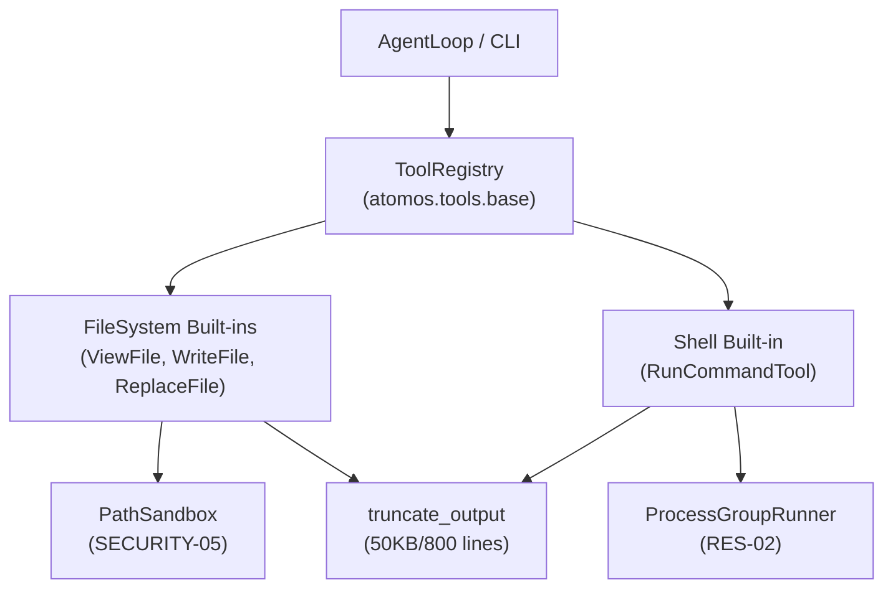

# Unit 3 Logical Components: Scoped Tool Registry & Built-ins

This document describes the logical architecture, component roles, and interactions for Unit 3.

---

## 1. Component Architecture Diagram

---

## 2. Logical Components Breakdown

### 2.1 `BaseTool[TParams]` (`atomos.tools.base`)
- **Type**: Generic Base Class
- **Responsibilities**:
  - Encapsulates tool name, description, and Pydantic parameter model.
  - Automatically exports OpenAI function schemas (`to_openai_tool()`).

### 2.2 `ToolRegistry` (`atomos.tools.base`)
- **Type**: Container / Service
- **Responsibilities**:
  - Registers, unregisters (via `Disposable`), and dispatches tool execution.
  - Validates JSON arguments, catches uncaught exceptions, and formats `ToolResult` (`SECURITY-08`).

### 2.3 `PathSandbox` (`atomos.tools.builtins.fs`)
- **Type**: Security Sandboxing Component
- **Responsibilities**:
  - Validates canonical path confinement within `workspace_root` (`SECURITY-05`).

### 2.4 `ProcessGroupRunner` (`atomos.tools.builtins.shell`)
- **Type**: Process Isolation & Resilience Component
- **Responsibilities**:
  - Spawns subprocesses in isolated process groups and terminates the complete tree on timeout (`RES-02`).

### 2.5 Built-in File & Shell Tools
- `ViewFileTool`: Reads file content with offset and line limits.
- `WriteFileTool`: Creates or overwrites files atomically.
- `ReplaceFileTool`: Locates target string and executes replacement.
- `RunCommandTool`: Runs shell commands within the sandboxed workspace.
