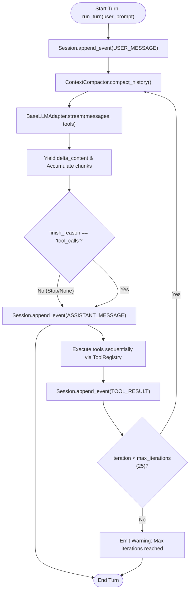

# Unit 4 Business Logic Model: Agent Loop & Turn Driver

This document specifies the turn lifecycle, tool calling state transitions, event sourcing persistence sequence, and streaming token dispatch for Unit 4.

---

## 1. Turn Lifecycle Flowchart

---

## 2. Multi-Turn Driver Sequence

1. **User Message Reception**:
   - Agent receives `user_prompt` string.
   - Appends `SessionEvent(USER_MESSAGE, {"content": user_prompt})` to session store.
   - Broadcasts `agent/turn_start` on Context.

2. **Context Window Assembly & Compaction**:
   - Reconstructs `list[LLMMessage]` from session events.
   - Applies sliding window compaction preserving `system_prompt` and the last $N$ turns.

3. **LLM Streaming Iteration**:
   - Resolves active registered tools from `ToolRegistry.get_openai_tools()`.
   - Calls `BaseLLMAdapter.stream(messages, tools)` wrapped by `retry_async_stream`.
   - Yields text tokens in real time to caller.
   - Accumulates `ToolCallFragment` deltas via `ToolCallAccumulator`.

4. **Tool Call Execution & Event Sourcing**:
   - If tool calls were emitted:
     - Persists `ASSISTANT_MESSAGE` with `tool_calls` array.
     - For each tool call in sequence:
       - Broadcasts `agent/tool_start` on Context.
       - Dispatches `ToolRegistry.execute_tool(name, arguments)`.
       - Persists `SessionEvent(TOOL_RESULT, result.to_dict())`.
       - Broadcasts `agent/tool_end` on Context.
     - Increments `iteration` counter.
     - If `iteration < max_iterations`: loops back to Step 2.
     - If `iteration >= max_iterations`: logs warning and concludes turn.

5. **Turn Completion**:
   - Broadcasts `agent/turn_end` on Context.
