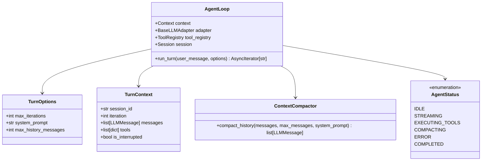

# Unit 4 Domain Entities: Agent Loop & Turn Driver

This document defines the domain models, state machine statuses, turn execution contexts, and compaction strategies for **Unit 4: Agent Loop & Turn Driver** in `atomos`.

---

## 1. Domain Entity Class Diagram

---

## 2. Entity Specifications

### 2.1 `AgentStatus`
- **Values**:
  - `IDLE`: Waiting for user prompt.
  - `STREAMING`: Streaming tokens from LLM adapter.
  - `EXECUTING_TOOLS`: Executing requested tool calls against `ToolRegistry`.
  - `COMPACTING`: Trimming message history to conform with context budget.
  - `COMPLETED`: Turn finished; waiting for next input.
  - `ERROR`: Unrecoverable error occurred.

### 2.2 `TurnOptions`
- **Fields**:
  - `max_iterations`: `int = 25` — Maximum consecutive tool execution loops per turn.
  - `system_prompt`: `str` — Default system instructions.
  - `max_history_messages`: `int = 50` — Threshold for history compaction.

### 2.3 `ContextCompactor`
- **Responsibilities**:
  - Implements sliding window compaction: Preserves system message + latest $N$ messages, injecting a compaction summary event marker when older turns are pruned.

### 2.4 `AgentLoop`
- **Responsibilities**:
  - Orchestrates multi-turn conversation turns.
  - Streams response deltas to caller while persisting events (`USER_MESSAGE`, `ASSISTANT_MESSAGE`, `TOOL_CALL`, `TOOL_RESULT`) to `Session`.
  - Broadcasts `agent/turn_start`, `agent/token`, `agent/tool_start`, `agent/turn_end` events to `Context`.
