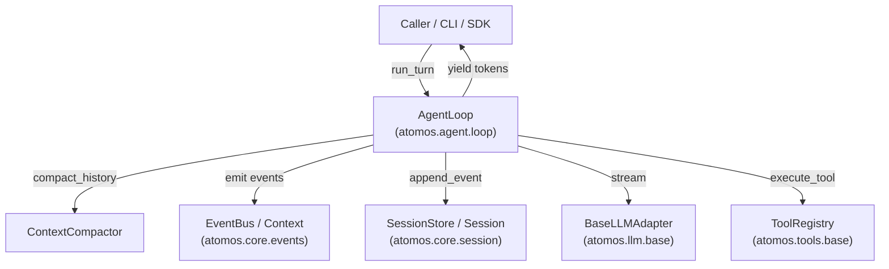

# Unit 4 Logical Components: Agent Loop & Turn Driver

This document specifies the logical component structure and interaction model for Unit 4.

---

## 1. Component Architecture Diagram

---

## 2. Logical Components Breakdown

### 2.1 `AgentLoop` (`atomos.agent.loop`)
- **Type**: Core Turn Driver
- **Responsibilities**:
  - Coordinates turn lifecycle, streaming token delivery, and tool calling iterations.
  - Automatically persists user, assistant, and tool result events to `Session`.
  - Dispatches non-blocking lifecycle events to `Context`.

### 2.2 `ContextCompactor` (`atomos.agent.loop`)
- **Type**: Context Strategy Component
- **Responsibilities**:
  - Converts stored session event payloads into LLM chat messages (`LLMMessage`).
  - Prunes excess messages using sliding window heuristics while preserving the system prompt.

### 2.3 `TurnOptions` (`atomos.agent.loop`)
- **Type**: Configuration Model
- **Responsibilities**:
  - Encapsulates execution parameters (`max_iterations`, `system_prompt`, `max_history_messages`).
