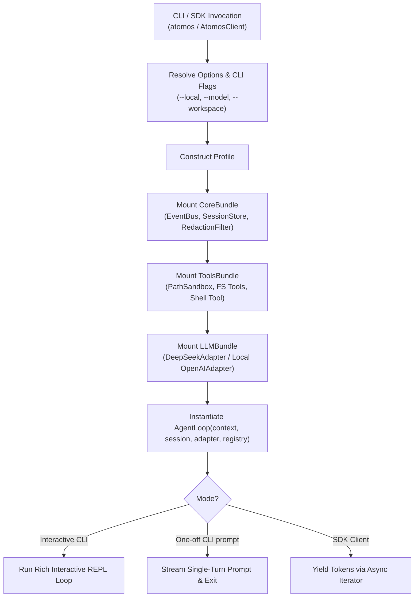

# Unit 5 Business Logic Model: Bundles, CLI & SDK

This document describes the application bootstrapping flow, bundle mounting lifecycle, Typer/Rich CLI interface, and the async Python SDK usage.

---

## 1. Bootstrapping Flowchart



---

## 2. CLI Command Structure

### 2.1 Interactive Terminal Chat
```bash
# Default Cloud execution (DeepSeek / OpenAI)
atomos

# Local LLM execution (Ollama at http://localhost:11434/v1)
atomos --local
atomos -l --model qwen2.5-coder

# Execute with specific workspace root
atomos --workspace ./my-project "Inspect the test suite"

# Command alias
atimos --local
```

---

## 3. Programmatic SDK Usage

```python
import asyncio
from atomos.sdk import AtomosClient

async def main():
    # Connect with local runner
    async with AtomosClient(workspace=".", is_local=True, model="deepseek-r1") as client:
        async for token in client.chat("Analyze the project structure"):
            print(token, end="", flush=True)

if __name__ == "__main__":
    asyncio.run(main())
```
