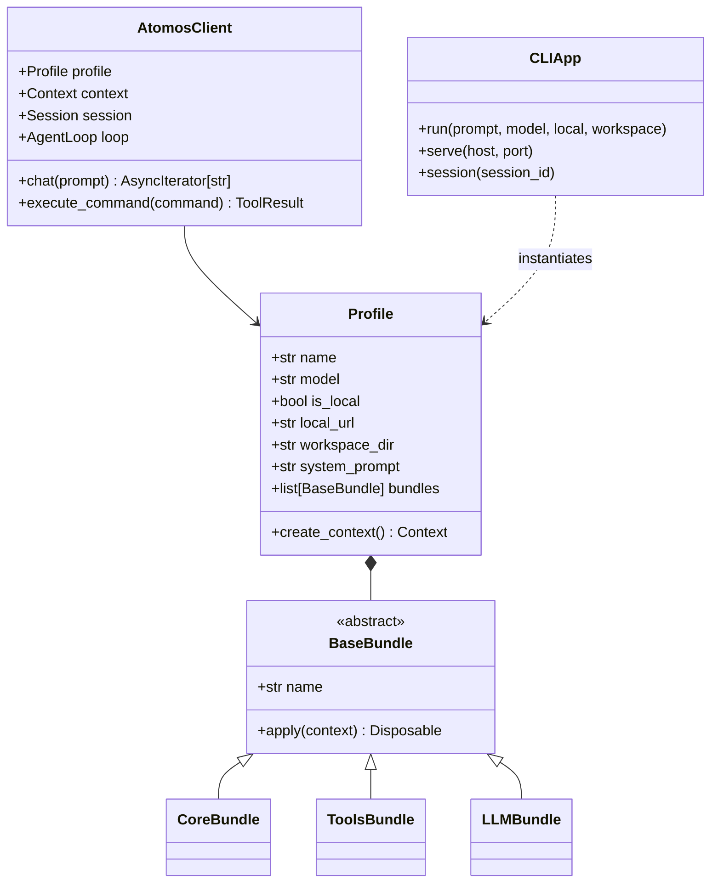

# Unit 5 Domain Entities: Bundles, CLI & SDK

This document defines the domain models, profile configuration, bundle lifecycles, Typer CLI commands, and programmatic Python SDK interfaces for **Unit 5: Bundles, CLI & SDK** in `atomos`.

---

## 1. Domain Entity Class Diagram

---

## 2. Entity Specifications

### 2.1 `BaseBundle` (`atomos.boot.bundles.base`)
- **Responsibilities**:
  - Encapsulates modular service and listener registration into `Context`.
  - Produces `Disposable` handles unbinding mounted services when disposed.

### 2.2 `Profile` (`atomos.boot.profile`)
- **Fields**:
  - `model`: `str = "deepseek-chat"` (or `"deepseek-r1"` when `--local` is active).
  - `is_local`: `bool = False`.
  - `local_url`: `str = "http://localhost:11434/v1"`.
  - `workspace_dir`: `Path = Path.cwd()`.
  - `system_prompt`: `str = ""`.
- **Methods**:
  - `bootstrap() -> tuple[Context, Session, AgentLoop]`: Creates and wires up the full container hierarchy.

### 2.3 `AtomosClient` (`atomos.sdk.client`)
- **Responsibilities**:
  - High-level async context manager and interface for programmatic Python agent turns (`async with AtomosClient(...) as client:`).
  - Exposes `async def chat(prompt: str) -> AsyncIterator[str]`.

### 2.4 `CLIApp` (`atomos.cli.main`)
- **Responsibilities**:
  - Typer CLI entrypoint supporting both `atomos` and `atimos` binary aliases.
  - Commands:
    - Default interactive chat: `atomos [PROMPT]`
    - Flags: `--model / -m`, `--local / -l`, `--local-url`, `--workspace / -w`, `--session / -s`.
  - Rich interactive terminal UI with live syntax highlighting and tool status panels.
