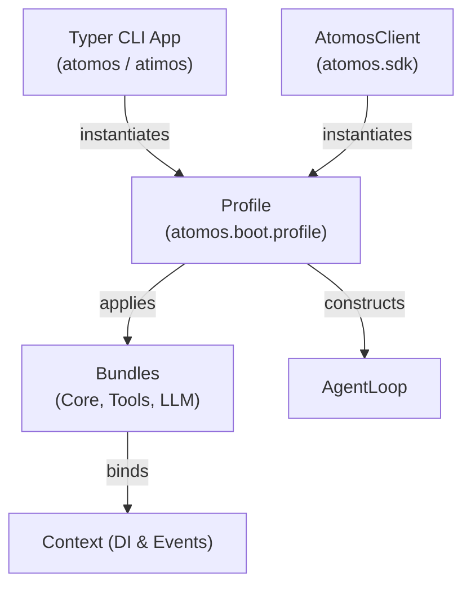

# Unit 5 Logical Components: Bundles, CLI & SDK

This document specifies the logical component structure and interaction model for Unit 5.

---

## 1. Component Architecture Diagram

---

## 2. Logical Components Breakdown

### 2.1 `Profile` (`atomos.boot.profile`)
- **Type**: Bootstrapper Component
- **Responsibilities**:
  - Encapsulates configuration and instantiates the full object graph (Context, SessionStore, ToolRegistry, LLMAdapter, AgentLoop).

### 2.2 `BaseBundle` (`atomos.boot.bundles.base`)
- **Type**: Extension Architecture
- **Responsibilities**:
  - `CoreBundle`: Configures session storage and event filters.
  - `ToolsBundle`: Mounts filesystem and shell tools into registry.
  - `LLMBundle`: Configures cloud or local LLM adapters.

### 2.3 `CLIApp` (`atomos.cli.main`)
- **Type**: User Interface
- **Responsibilities**:
  - Provides `atomos` command (and alias `atimos`).
  - Flags: `--local`, `--model`, `--workspace`, `--session`.
  - Integrates Rich Live markdown streaming.

### 2.4 `AtomosClient` (`atomos.sdk.client`)
- **Type**: Programmatic API
- **Responsibilities**:
  - Async context manager exposing `async def chat(prompt) -> AsyncIterator[str]`.
