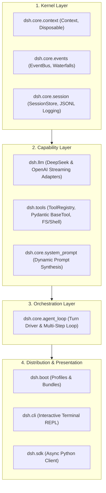

# Master Application Design: DeepSeek Harness Python

## 1. System Overview
DeepSeek Harness (`dsh`) Python reimplementation ports the extensible, plugin-centric architecture of DeepSeek Harness into modern, idiomatic Python (`>=3.11`). It combines a Cordis-equivalent dependency injection kernel, durable event-sourced session tracking, unified streaming LLM adapters, schema-driven Pydantic tool pipelines, and composable application launchers.

---

## 2. Core Architectural Pillars

---

## 3. Subsystem Architecture

### 3.1 Kernel & Lifecycle (`dsh.core.context`, `dsh.core.events`)
- **Dependency Injection**: `Context` manages services with typed resolution and scoped bindings.
- **Event Bus**: Supports durable broadcast events (`session/event`) and waterfall middleware (`agent/pre-step`, `tools/pre-execute`).
- **Clean Unwinding**: Reversible resource bindings using `Disposable` tokens.

### 3.2 Session Persistence (`dsh.core.session`)
- **Event Sourcing**: Monotonically ordered `SessionEvent` records (`turn/start`, `user/message`, `assistant/chunk`, `tool/call`, `tool/result`, `turn/end`).
- **Atomic File Store**: Flushed to JSONL files with atomic rename to prevent corruption (`RES-03`).
- **Property Invariants**: Verified with `hypothesis` for lossless round-trip serialization (`PBT-01`).

### 3.3 LLM Client Layer (`dsh.llm`)
- **Streaming Adapters**: Asynchronous `httpx` client handling SSE chunk streams.
- **Resilient Retry**: Exponential backoff with jitter on network disconnects (`RES-01`).
- **Zero Credential Leaks**: API keys loaded strictly from environment variables with automated log masking (`SECURITY-03`, `SECURITY-07`).

### 3.4 Scoped Tool Runtime (`dsh.tools`)
- **Schema Generation**: Derived automatically from Pydantic `BaseModel` annotations (`BaseTool[TParams]`).
- **Security Boundaries**: Path traversal prevention and workspace confinement checks (`SECURITY-05`).
- **Subprocess Isolation**: Shell command execution wrapped with process tree termination on timeout (`RES-02`).

### 3.5 Agent Turn Orchestrator (`dsh.core.agent_loop`)
- **Turn Flow**: Claims incoming user input -> compiles system prompt & tool schemas -> executes model step -> invokes tools -> continues until completion.
- **Safety Limits**: Max steps per turn guards and clean cancellation hooks (`stop_turn()`).

### 3.6 Launchers & SDK (`dsh.cli`, `dsh.sdk`, `dsh.boot`)
- **CLI REPL**: Rich terminal interface with streaming markdown tokens, progress spinners, and command history.
- **Python SDK**: High-level programmatic interface (`from dsh import Context, AgentLoop`).

---

## 4. Reference Artifacts
- Detailed Components: [`components.md`](components.md)
- Interface Signatures: [`component-methods.md`](component-methods.md)
- Service Layer Orchestration: [`services.md`](services.md)
- Dependency Matrix: [`component-dependency.md`](component-dependency.md)
