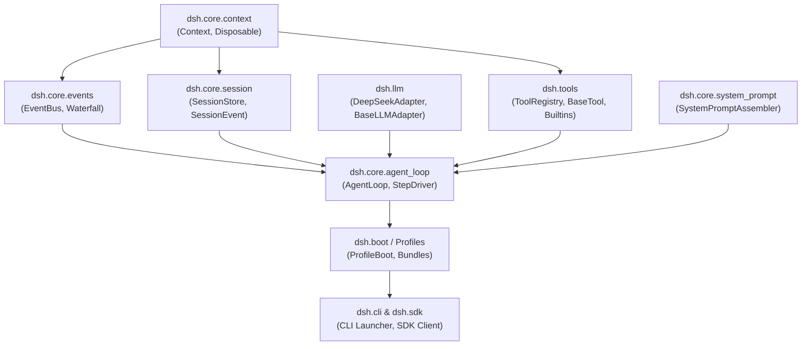

# Component Dependency & Data Flow

This document details the inter-component dependency relationships, communication protocols, and data flow pipelines.

---

## 1. Component Dependency Matrix

| Component | Depends On (Direct) | Depends On (via Context) | Type of Dependency |
|---|---|---|---|
| `dsh.core.context` | Python Standard Library | None | Kernel / Inversion of Control |
| `dsh.core.events` | `dsh.core.context` | None | Event infrastructure |
| `dsh.core.session` | `dsh.core.context`, `pydantic` | `ctx.events` | Persistence & Event Log |
| `dsh.llm` | `pydantic`, `httpx` | None | External Model Provider Adapter |
| `dsh.tools` | `pydantic`, `dsh.core.context` | `ctx.events` | Tool Execution Pipeline |
| `dsh.core.agent_loop` | `dsh.core.session`, `dsh.llm`, `dsh.tools` | `ctx.system_prompt`, `ctx.tools`, `ctx.llm` | Orchestration Engine |
| `dsh.cli` / `dsh.sdk` | `typer` / `rich`, `dsh.boot` | `ctx.agent_loop`, `ctx.sessions` | Application Layer |

---

## 2. Dependency Graph

---

## 3. Data Flow Pipelines

### 3.1 Event Ingestion & Append-Only Pipeline
- Source: Model stream or tool results.
- Ingestion: `Session.append_event(event_type, payload)` increments `seq`, derives event UUID, and creates immutable `SessionEvent`.
- Persistence: JSON stringified line appended to `~/.dsh/sessions/{session_id}.jsonl` with atomic flush.
- Broadcast: `ctx.emit("session/event", event)` notifies live listeners (CLI progress bars, WebSockets, telemetry).

### 3.2 Tool Execution Interceptor Pipeline
- Ingestion: Model calls tool `name` with `raw_args` (JSON string or dict).
- Validation: `BaseTool.param_schema.model_validate(raw_args)` ensures type safety, value ranges, and path confinement (rejects traversal).
- Interceptor Chain: Waterfall event `tools/pre-execute` runs security checks and user confirmations.
- Execution: `await tool.execute(params, context)` performs async FS or subprocess execution.
- Result Formatting: `tools/post-execute` captures stdout/stderr, formats clean markdown output, and updates session log.
