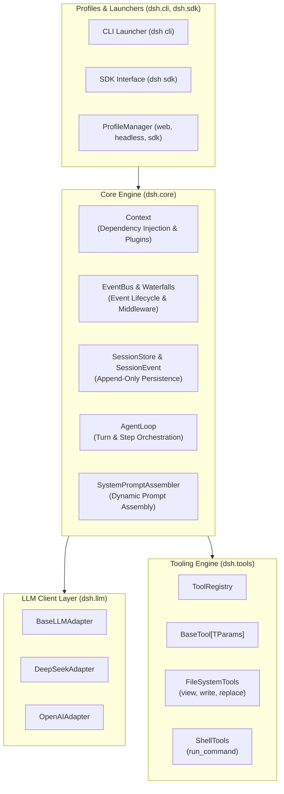

# Application Components: DeepSeek Harness Python

This document defines the high-level functional components, responsibilities, and public interfaces for the Python reimplementation of DeepSeek Harness (`dsh`).

---

## 1. Component Architecture Overview

---

## 2. Component Specifications

### 2.1 `dsh.core.context.Context`
- **Purpose**: Central dependency injection container and plugin lifecycle host (Cordis equivalent).
- **Responsibilities**:
  - Registering and resolving singleton and scoped services (`ctx.provide()`, `ctx.get()`).
  - Managing plugin mounts, unmounts, and disposable resource cleanup (`Disposable`).
  - Scoping event listeners to active plugin lifecycles.
- **Interfaces**: `Context`, `Plugin`, `Disposable`.

### 2.2 `dsh.core.events.EventBus`
- **Purpose**: Asynchronous event dispatching engine supporting serial listeners and waterfall interceptor pipelines.
- **Responsibilities**:
  - Emitting broadcast events (`session/event`, `turn/start`, `turn/end`).
  - Executing waterfall interceptors (`agent/pre-step`, `tools/pre-execute`, `tools/post-execute`) with `await next()`.
- **Interfaces**: `EventBus`, `WaterfallHandler`, `EventHandler`.

### 2.3 `dsh.core.session.SessionStore`
- **Purpose**: Durable append-only event-sourcing storage for conversation turns, tool calls, and state.
- **Responsibilities**:
  - Appending immutable `SessionEvent` records to in-memory history and atomic JSONL files on disk.
  - Replaying past session logs for history reconstruction.
  - Enforcing `PBT-01` serialization round-trips and `RES-03` atomic writes.
- **Interfaces**: `Session`, `SessionStore`, `SessionEvent`.

### 2.4 `dsh.core.agent_loop.AgentLoop`
- **Purpose**: Central turn and multi-step execution driver.
- **Responsibilities**:
  - Processing user input claims from the message inbox.
  - Assembling dynamic prompt sections and tool schemas.
  - Streaming model completions, accumulating tool call deltas, and dispatching tool executions.
  - Managing turn termination and iteration limit safeguards.
- **Interfaces**: `AgentLoop`, `TurnResult`, `StepContext`.

### 2.5 `dsh.llm.BaseLLMAdapter` & Adapters
- **Purpose**: Unified streaming LLM adapter layer.
- **Responsibilities**:
  - Connecting to DeepSeek API (`api.deepseek.com`) and OpenAI-compatible endpoints using asynchronous `httpx`.
  - Parsing server-sent events (SSE) into typed `LLMChunk` streams (content tokens and tool call fragments).
  - Executing exponential backoff retry with jitter on network drops (`RES-01`).
- **Interfaces**: `BaseLLMAdapter`, `DeepSeekAdapter`, `OpenAIAdapter`, `LLMMessage`, `LLMChunk`.

### 2.6 `dsh.tools.ToolRegistry` & Built-in Tools
- **Purpose**: Safe, schema-driven tool registration and execution pipeline.
- **Responsibilities**:
  - Parsing Pydantic `BaseModel` tool parameter schemas (`BaseTool[TParams]`).
  - Enforcing security path boundary checks (`SECURITY-05`) and execution timeouts (`RES-02`).
  - Providing built-in developer tools: `view_file`, `write_to_file`, `replace_file_content`, `run_command`.
- **Interfaces**: `ToolRegistry`, `BaseTool[TParams]`, `ToolResult`, `ToolContext`.

### 2.7 `dsh.cli` & `dsh.sdk`
- **Purpose**: User-facing entrypoints.
- **Responsibilities**:
  - CLI binary launcher for interactive chat (`dsh`) with real-time ANSI token streaming and prompt history.
  - Importable Python SDK package (`from dsh import Context, AgentLoop`) for embedding.
- **Interfaces**: `CLIApp`, `DSHClient`.
