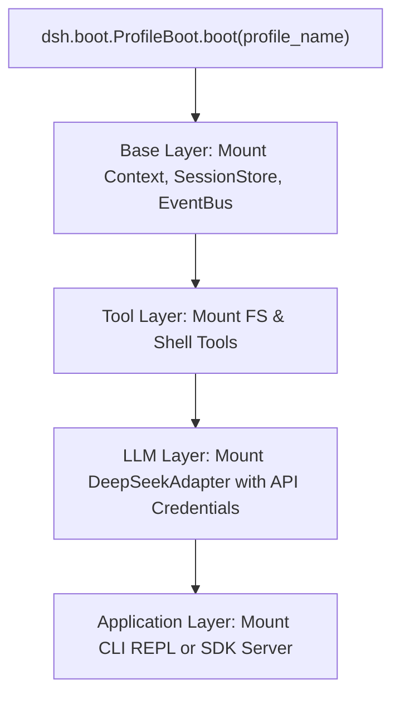

# Service Layer & Orchestration Patterns

This document defines the service orchestration patterns, Cordis dependency injection mechanics, and agent turn workflows.

---

## 1. Service Layer Architecture

The Python reimplementation organizes all runtime capabilities as injectable services mounted on `Context`:

| Service Key | Concrete Service Class | Purpose |
|---|---|---|
| `ctx.sessions` | `SessionStore` | Manages session instances and append-only event persistence |
| `ctx.events` | `EventBus` | Handles typed event broadcasting and waterfall middleware |
| `ctx.llm` | `BaseLLMAdapter` (e.g. `DeepSeekAdapter`) | Dispatches streaming LLM completions |
| `ctx.tools` | `ToolRegistry` | Manages Pydantic tool schemas and interceptors |
| `ctx.system_prompt` | `SystemPromptAssembler` | Dynamic prompt section builder |
| `ctx.agent_loop` | `AgentLoop` | Turn coordinator driving multi-step executions |

---

## 2. Boot & Profile Layering Pattern

A running `dsh` instance boots via composition layers:



- **Live Context**: When a bundle is mounted, it registers its services into `ctx`.
- **Reversible Lifecycles**: When unmounted, returned `Disposable` tokens cleanly unbind listeners and tool registrations.

---

## 3. End-to-End Turn Flow Sequence

```mermaid
sequenceDiagram
    autonumber
    actor User
    participant CLI as CLI / SDK
    participant Loop as AgentLoop
    participant Prompt as SystemPromptAssembler
    participant LLM as DeepSeekAdapter
    participant Reg as ToolRegistry
    participant Sess as SessionStore

    User->>CLI: Enter goal ("Create a FastAPI endpoint")
    CLI->>Loop: start_turn(session, prompt)
    Loop->>Sess: append_event(TURN_START)
    Loop->>Sess: append_event(USER_MESSAGE, payload)

    loop Step Loop (until no tool calls or stopped)
        Loop->>Prompt: assemble_sections(session, tool_schemas)
        Prompt-->>Loop: system_prompt_string
        Loop->>LLM: stream(messages, tools)
        LLM-->>Loop: stream tokens -> emit(assistant/chunk)
        Loop-->>CLI: stream real-time tokens to user
        LLM-->>Loop: complete assistant message with tool calls
        Loop->>Sess: append_event(ASSISTANT_MESSAGE)

        opt Tool Calls Present
            Loop->>Reg: execute_tool(tool_name, args, context)
            Reg->>Reg: Validate Pydantic schema (SECURITY-05)
            Reg->>Reg: Pre-execute hooks (permission / path bounds)
            Reg-->>Loop: ToolResult (output / error)
            Loop->>Sess: append_event(TOOL_RESULT)
        end
    end

    Loop->>Sess: append_event(TURN_END)
    Loop-->>CLI: TurnResult(status="completed", steps=N)
    CLI-->>User: Ready for next prompt
```
