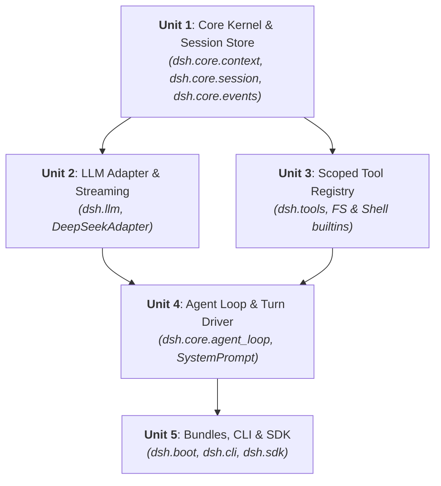

# Unit of Work Dependencies & Construction Sequence

This document details the inter-unit dependency matrix and recommended construction sequence.

---

## 1. Unit Dependency Matrix

| Unit | Depends On | Depended On By | Construction Order |
|---|---|---|---|
| **Unit 1**: Core Kernel & Session Store | Python Stdlib, Pydantic | Unit 2, Unit 3, Unit 4, Unit 5 | 1 (First) |
| **Unit 2**: LLM Adapter & Streaming | Unit 1 (`Context`), HTTPX | Unit 4, Unit 5 | 2 |
| **Unit 3**: Scoped Tool Registry & Built-ins | Unit 1 (`Context`), Pydantic | Unit 4, Unit 5 | 3 |
| **Unit 4**: Agent Loop & Turn Driver | Unit 1, Unit 2, Unit 3 | Unit 5 | 4 |
| **Unit 5**: Bundles, CLI & SDK | Unit 1, Unit 2, Unit 3, Unit 4 | End Users / Integrators | 5 (Final) |

---

## 2. Construction Sequence Flow

---

## 3. Contract Boundaries

- **Unit 1 -> Unit 2/3**: Exposes `Context.provide()`, `Context.get()`, `Context.on()`, and `SessionStore`.
- **Unit 2/3 -> Unit 4**: Exposes `BaseLLMAdapter.stream()` and `ToolRegistry.execute_tool()`.
- **Unit 4 -> Unit 5**: Exposes `AgentLoop.start_turn()` returning `TurnResult`.
