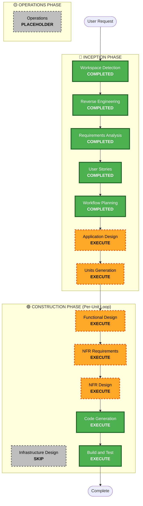

# Execution Plan: DeepSeek Harness Python Reimplementation

## Detailed Analysis Summary

### Transformation Scope
- **Transformation Type**: System-Wide Architectural & Language Port
- **Primary Changes**: Reimplementing the DeepSeek Harness kernel, plugin architecture, session event log, agent execution loop, LLM streaming adapters, scoped tool runtime, and CLI launchers in Python.
- **Related Components**: Python package root (`python/dsh/` or `dsh_py/`), test suites (`tests/`), CLI binary, and developer documentation.

### Change Impact Assessment
- **User-facing changes**: Yes — Provides native Python CLI commands (`dsh` / `python -m dsh`) and Python SDK APIs (`from dsh import Context, AgentLoop`).
- **Structural changes**: Yes — Translates Cordis TypeScript micro-kernel paradigms into idiomatic Python `asyncio` and Pydantic-based contracts.
- **Data model changes**: Yes — Pydantic schemas for `SessionEvent`, `ToolDefinition`, `LLMMessage`, `TurnResult`.
- **API changes**: Yes — Python async functions and protocols.
- **NFR impact**: Yes — Enforcing Security Baseline (`SECURITY-01` to `SECURITY-08`), Resiliency retry backoff, and Hypothesis Property-Based Testing (`PBT-01` to `PBT-03`).

### Risk Assessment
- **Risk Level**: Medium (Clear reference implementation in TypeScript, porting into clean modular Python units).
- **Rollback Complexity**: Low (Isolated new Python implementation without disrupting existing TypeScript repository files).
- **Testing Complexity**: Comprehensive (Pytest async unit tests, Hypothesis property-based testing, and end-to-end turn execution tests).

---

## Workflow Visualization

### Mermaid Diagram


### Text Alternative
```text
Phase 1: INCEPTION
- Stage 1: Workspace Detection (COMPLETED)
- Stage 2: Reverse Engineering (COMPLETED)
- Stage 3: Requirements Analysis (COMPLETED)
- Stage 4: User Stories (COMPLETED)
- Stage 5: Workflow Planning (COMPLETED)
- Stage 6: Application Design (EXECUTE - System architecture & module contracts)
- Stage 7: Units Generation (EXECUTE - Unit decomposition)

Phase 2: CONSTRUCTION (Iterative across implementation units)
- Stage 8: Functional Design (EXECUTE per unit)
- Stage 9: NFR Requirements Assessment (EXECUTE per unit - Security, Resiliency, PBT)
- Stage 10: NFR Design (EXECUTE per unit)
- Stage 11: Infrastructure Design (SKIP - Pure application codebase, no cloud infra needed)
- Stage 12: Code Generation (EXECUTE - Python implementation)
- Stage 13: Build and Test (EXECUTE - Pytest, Ruff, Mypy, Hypothesis)

Phase 3: OPERATIONS
- Stage 14: Operations (PLACEHOLDER)
```

---

## Phases to Execute & Rationales

### 🔵 INCEPTION PHASE
- [x] **Workspace Detection** (COMPLETED): Analyzed brownfield TypeScript repository.
- [x] **Reverse Engineering** (COMPLETED): Generated 8 architectural and codebase reverse engineering artifacts.
- [x] **Requirements Analysis** (COMPLETED): Defined functional & non-functional requirements and extension opt-ins.
- [x] **User Stories** (COMPLETED): Generated 4 personas and 6 INVEST user stories with Gherkin scenarios.
- [x] **Workflow Planning** (IN PROGRESS): Established execution path and multi-unit construction strategy.
- [ ] **Application Design** (EXECUTE):
  - **Rationale**: Needed to design the high-level Python system architecture, Cordis context service registry, async event bus, and subsystem interfaces.
- [ ] **Units Generation** (EXECUTE):
  - **Rationale**: Decomposes the Python port into distinct, modular development units for clean test-driven construction.

### 🟢 CONSTRUCTION PHASE (Per-Unit Execution)
- [ ] **Functional Design** (EXECUTE per unit): Detailed class designs, method signatures, and state machines.
- [ ] **NFR Requirements Assessment** (EXECUTE per unit): Verifying security parameters, resiliency retry policies, and testable invariants.
- [ ] **NFR Design** (EXECUTE per unit): Concrete design for secret masking, timeouts, and Hypothesis PBT strategies.
- [ ] **Infrastructure Design** (SKIP):
  - **Rationale**: DeepSeek Harness Python is a standalone application/library; no cloud CDK or Terraform infrastructure is required.
- [ ] **Code Generation** (EXECUTE): Python source code implementation, test suites, and project configurations.
- [ ] **Build and Test** (EXECUTE): Full automated verification with `pytest`, `pytest-asyncio`, `hypothesis`, and `ruff`.

### 🟡 OPERATIONS PHASE
- [ ] **Operations** (PLACEHOLDER): Future deployment and package release workflows.

---

## Proposed Units Decomposition
1. **Unit 1: Core Kernel & Event Sourcing Store** (`dsh.core.context`, `dsh.core.events`, `dsh.core.session`)
2. **Unit 2: LLM Adapter & Streaming Engine** (`dsh.llm`, `dsh.llm.providers`)
3. **Unit 3: Scoped Tool Registry & Built-in Tools** (`dsh.tools`, `dsh.tools.fs`, `dsh.tools.shell`)
4. **Unit 4: Agent Loop & Turn Orchestrator** (`dsh.core.agent_loop`, `dsh.core.system_prompt`)
5. **Unit 5: Bundles, CLI Launcher & SDK Interface** (`dsh.cli`, `dsh.sdk`, `dsh.profiles`)

---

## Success Criteria & Quality Gates
- **Primary Goal**: Fully functional, modular Python implementation of DeepSeek Harness supporting CLI chat, tool calling, and session persistence.
- **Quality Gates**:
  - 100% compliance with `SECURITY-01` through `SECURITY-08` baseline constraints.
  - Resiliency backoff and subprocess timeout protections.
  - Property-Based Testing suite using `hypothesis` for serialization round-trips and state invariants.
  - Clean linting (`ruff`) and strict typing (`mypy`).
