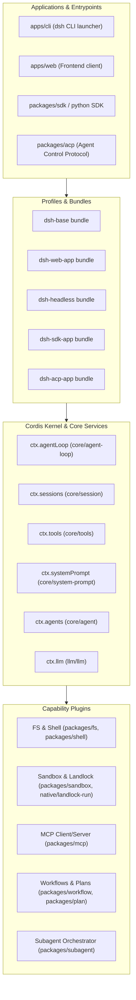

# System Architecture

## System Overview

DeepSeek Harness (`dsh`) is structured around a micro-kernel architecture where all capabilities—from model adapters and tool registries to session stores and web interfaces—are implemented as modular plugins on top of the **Cordis** framework. The core runtime provides lifecycle orchestration, scoped contexts, and an append-only event-sourcing model.

## Architecture Diagram



## Component Descriptions

### Core Engine (`packages/core/*`)
- **Purpose**: Core orchestration, execution pipelines, session persistence.
- **Responsibilities**:
  - `core/session`: Implements append-only `SessionEvent` event log and state stores.
  - `core/agent-loop`: Drives turns, waterfall event handlers, prompt compilation, and tool calling loops.
  - `core/tools`: Scoped tool registration, validation, permissions, and execution pipelines.
  - `core/system-prompt`: Composable prompt section assembly and dynamic injection.
  - `core/scope`: Per-agent scoped registration primitives and lifecycle hooks.
- **Dependencies**: Cordis framework (`cordis`).
- **Type**: Application Core / Framework.

### Model Integration (`packages/llm/*`)
- **Purpose**: Unified LLM abstraction and provider streaming adapters.
- **Responsibilities**: Normalized message schemas, streaming parser, fallback management, token accounting.
- **Type**: Adapter / Library.

### Host & Execution Environment (`packages/host/*`, `packages/fs/*`, `packages/shell/*`, `packages/sandbox/*`)
- **Purpose**: Host environment interaction and sandboxing.
- **Responsibilities**: Safe filesystem access, terminal streaming, process execution, and Landlock/E2B isolation.
- **Type**: Application / Infrastructure.

### Bundles & Launchers (`packages/bundle/*`, `packages/boot/*`, `apps/*`)
- **Purpose**: Assembles Cordis configuration rows into distributable application profiles.
- **Responsibilities**: Booting CLI, Web Server, ACP Server, or headless automation.
- **Type**: Application Bootstrap.

## Data Flow (Agent Turn Flow)

```mermaid
sequenceDiagram
    autonumber
    actor User
    participant CLI as dsh App
    participant Loop as Agent Loop
    participant Sess as Session Log
    participant LLM as LLM Provider
    participant Tool as Scoped Tools

    User->>CLI: Sends prompt / goal
    CLI->>Loop: turn/start & claims inbox input
    Loop->>Sess: Append user/message
    Loop->>Loop: Assemble system prompt & tool schemas
    Loop->>LLM: agent/request -> llm/stream
    LLM-->>Loop: assistant/chunk* -> assistant/message with tool calls
    Loop->>Sess: Append assistant/message
    Loop->>Tool: tools/pre-execute -> tools/execute -> tools/post-execute
    Tool-->>Loop: tool/result*
    Loop->>Sess: Append tool/result
    Loop->>User: Stream response / complete turn (turn/end)
```

## Integration Points
- **LLM APIs**: DeepSeek, OpenAI, Anthropic, Ollama, custom OpenAI-compatible endpoints.
- **MCP Servers**: Model Context Protocol servers over stdio or SSE.
- **LSP Servers**: Language servers for code intelligence and diagnostics.
- **Sandboxes**: Landlock (Linux kernel isolation) and E2B cloud containers.
- **Web UI & RPC**: REST & WebSocket API, JSON-RPC for SDK clients.
