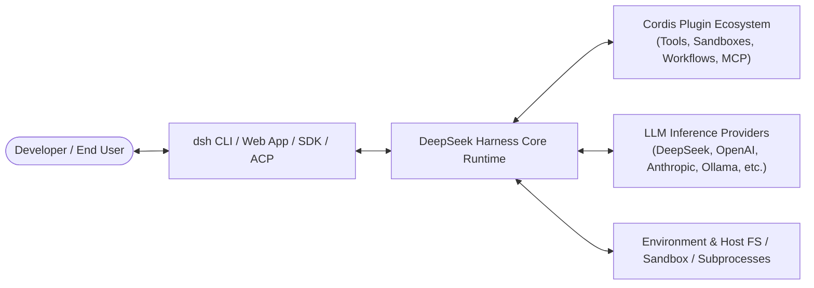

# Business Overview

## Business Context Diagram

## Business Description

- **Business Description**: DeepSeek Harness (`dsh`) is an open-source, extensible AI agent harness developed by DeepSeek AI. It is designed to bridge LLMs with real-world developer workflows, developer tools, sandboxed execution environments, and complex automation pipelines through an "everything-is-a-plugin" micro-kernel architecture powered by Cordis.
- **Business Transactions**:
  1. **Interactive Chat & Agent Orchestration**: Running multi-turn developer sessions via Web UI or CLI with live tool streaming, approvals, and context compaction.
  2. **Automated Task Execution (ACP & Headless)**: Executing non-interactive background automations, batch scripts, and CI/CD agent workflows.
  3. **Multi-Agent & Subagent Delegation**: Spawning specialized subagents for research, testing, or multi-step code refactoring.
  4. **Tool & MCP Integration**: Seamlessly discovering, executing, and securing filesystem tools, shell execution, MCP servers, LSP language servers, and E2B sandbox containers.
  5. **Session Persistence & Resumption**: Storing append-only event streams and session state allowing instant replay, recovery, and auditability.
- **Business Dictionary**:
  - **Harness**: The runtime environment hosting agent loops, plugin hooks, tool pipelines, and communication channels.
  - **Cordis Context (`ctx`)**: The inversion-of-control container managing plugin lifecycle, scoped services, events, and reversible resource registrations.
  - **Profile**: A named boot configuration preset (e.g., `web`, `headless`, `sdk`, `acp`, `sdk-minimal`) defining which plugin bundles are mounted.
  - **Bundle**: A distribution package of Cordis config rows and mounted services.
  - **Turn & Step**: A step is a single model invocation plus its tool executions; a turn represents one or more steps fulfilling an incoming user goal/input.

## Component Level Business Descriptions

### `apps/cli` & `apps/web`
- **Purpose**: Main entrypoints for developer interaction.
- **Responsibilities**: Command-line flag parsing, profile launching, interactive terminal sessions, browser UI hosting.

### `packages/core/*`
- **Purpose**: Central orchestration engine.
- **Responsibilities**: Manages session event logs (`core/session`), agent execution loop (`core/agent-loop`), system prompt synthesis (`core/system-prompt`), scoped tools (`core/tools`), and scoped contexts (`core/scope`).

### `packages/llm/*`
- **Purpose**: LLM provider communication.
- **Responsibilities**: Normalizes streaming completions, tool call parsing, and client adapters across various model backends.

### `packages/fs/*` & `packages/sandbox/*`
- **Purpose**: Secure environment interactions.
- **Responsibilities**: Provides filesystem manipulation tools, path boundary checks, landlock isolation, and containerized sandbox runtimes.

### `packages/mcp/*`, `packages/lsp/*`, `packages/workflow/*`
- **Purpose**: Ecosystem interoperability.
- **Responsibilities**: Connects Model Context Protocol (MCP) servers, Language Server Protocol (LSP) diagnostics, and structured multi-step workflows.
