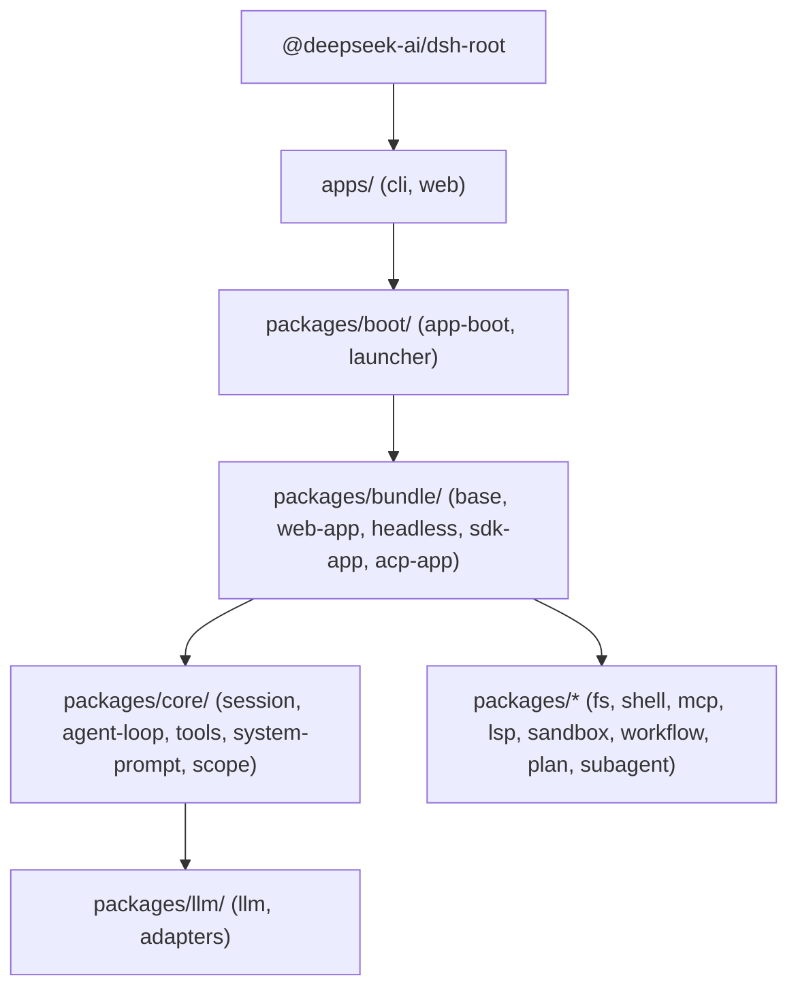

# Code Structure

## Build System
- **Type**: `pnpm` monorepo with `tsdown` and TypeScript project references (`tsc -b`).
- **Configuration**:
  - `package.json`: Root scripts for build (`tsx scripts/build.ts`), typecheck, oxlint, vitest.
  - `pnpm-workspace.yaml`: Workspaces across `packages/*/*`, `apps/*`, `native/*`, `vendor/*`, `website`.
  - `tsconfig.json` / `tsconfig.base.json` / `tsconfig.host.json` / `tsconfig.client.json`: Configured for multi-target dual ESM builds (Host face vs. Client face).

## Key Modules Hierarchy

## Existing Files Inventory (Key Packages)

- `apps/cli/src/index.ts` - Main CLI binary entrypoint implementing command parser and profile bootstrap.
- `packages/core/agent-loop/src/index.ts` - Core agent loop managing turns, steps, and tool execution orchestration.
- `packages/core/session/src/index.ts` - Durable event log and in-memory session state management.
- `packages/core/tools/src/index.ts` - Tool registry, permission boundaries, and execution pipeline.
- `packages/core/system-prompt/src/index.ts` - Dynamic system prompt section assembler.
- `packages/llm/llm/src/index.ts` - LLM adapter layer, streaming event decoder, and model abstraction.
- `packages/fs/fs/src/index.ts` - File system tools (`view_file`, `write_to_file`, `replace_file_content`, etc.).
- `packages/shell/shell/src/index.ts` - Terminal and shell execution tools (`run_command`, etc.).
- `packages/mcp/mcp/src/index.ts` - Model Context Protocol client & server integrations.
- `packages/subagent/subagent/src/index.ts` - Subagent lifecycle and delegated task dispatcher.

## Design Patterns

### 1. Inversion of Control & Micro-Kernel (Cordis)
- **Location**: Throughout all `packages/*`
- **Purpose**: Modular, pluggable architecture where every subsystem is an independent plugin that registers services and event listeners.
- **Implementation**: Plugins extend `cordis.Context`, export a standard plugin contract with schema and lifecycle hooks.

### 2. Event Sourcing / Append-Only Log
- **Location**: `packages/core/session`
- **Purpose**: Complete auditability, replayability, and deterministic session resumption.
- **Implementation**: `SessionEvent` records all turns, messages, tool calls, and results without destructive mutations.

### 3. Waterfall Middleware Pipeline
- **Location**: `packages/core/agent-loop`, `packages/core/tools`
- **Purpose**: Intercept, rewrite, or validate requests and tool executions in a chain of responsibility.
- **Implementation**: Event handlers receive `(data, next)` and invoke `next()` to delegate to subsequent listeners.

## Critical Dependencies
- **cordis**: Version `^3.x` - Framework providing context, lifecycle, and plugin injection.
- **tsdown**: Fast TypeScript bundling engine for host and client distribution.
- **vitest**: Test runner supporting unit, e.g., e2e, snapshot, and web stress tests.
- **oxlint**: High-performance linter for rapid code-quality verification.
