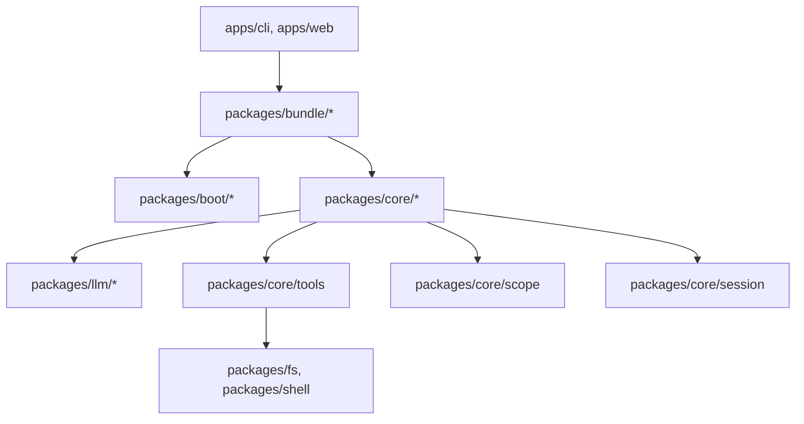

# Dependencies

## Internal Dependencies

### Key Package Relationships
- **`apps/cli` depends on `packages/boot/app-boot`**:
  - **Type**: Runtime
  - **Reason**: Boots named profiles and loads bundle configurations.
- **`packages/core/agent-loop` depends on `packages/core/session` & `packages/llm/llm`**:
  - **Type**: Compile & Runtime
  - **Reason**: Dispatches model streams and persists turn events into session log.
- **`packages/core/tools` depends on `cordis`**:
  - **Type**: Compile & Runtime
  - **Reason**: Uses Cordis context for scoped registrations and lifecycle unbinding.

## External Dependencies

### Runtime Dependencies
- **cordis**: Micro-kernel plugin container. (License: MIT)
- **zod**: Schema validation for tools and config catalogs. (License: MIT)
- **ws**: WebSocket implementation for real-time turn event streams. (License: MIT)
- **dotenv**: Environment variable loader. (License: BSD-2-Clause)

### Development Dependencies
- **typescript**: Compiler and type checker. (License: Apache-2.0)
- **tsdown**: Dual-face bundle compiler. (License: MIT)
- **vitest**: Test framework. (License: MIT)
- **oxlint**: Linter engine. (License: MIT)
- **knip**: Dead-code analysis. (License: MIT)
- **lefthook**: Git hook manager. (License: MIT)
